# Upbit Auto Trader & Analysis

Upbit Auto Trader and Analysis for Python Upbit API 
- Upbit API: [[Pyubit](https://github.com/sharebook-kr/pyupbit)]
- Fbprophet: 

## 1. Environments

- Window 10
- Python 3.7.6
- python 3.8.5 (Anaconda)
- pyupbit
- fbprophet

## 2. Main Configuration

### 2. 1 Analyzer
Analyzer will record coin price data as excel file.

### 2. 2 AutoTrader
AutoTrader will trading Top20 rate of increase.
- You should edit Upbit API keys in `AutoTraderV1.py` which are `access_key` & `secret_key`.
- This will be update as soon as possible.

### 2. 3 AIAutoTrader
AIAutoTrader will trading 20 stocks that will give you the best returns.
- You should edit Upbit API keys in `AIAutoTraderV1.py` which are `access_key` & `secret_key`.
- This is unusable now cause it's not completed.
- This will be update as soon as possible.

This is based on next video:
- [Reference] : https://www.youtube.com/watch?v=Teju_e9TI3s&ab_channel=%EC%A1%B0%EC%BD%94%EB%94%A9JoCoding

## 3. Run

## 4. Use

### 4. 1 Analyzer.py
```bash
python Analyzer.py
```
- `Analyzer.py` will analyze the data of coin price at the time of execution.
- Analyzed result will be saved in `root` directory as `.xlsm` file.

### 4. 2 AutoTraderV1.py
```
python AutoTraderV1.py
```
AutoTrader will trading Top20 rate of increase.
- You should edit Upbit API keys in `AutoTraderV1.py` which are `access_key` & `secret_key`.
- This will be update as soon as possible.

### 4. 3 AIAutoTraderV1.py
```
python AIAutoTraderV1.py
```
AIAutoTrader will trading 20 stocks that will give you the best returns.
- You should edit Upbit API keys in `AIAutoTraderV1.py` which are `access_key` & `secret_key`.
- This is unusable now cause it's not completed.
- This will be update as soon as possible.

## 5. Results

### 5. 1 Daily Analysis

<p align="center">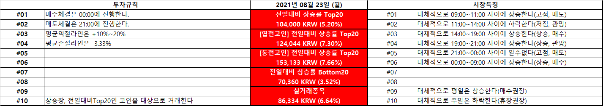</p>
<p align="center">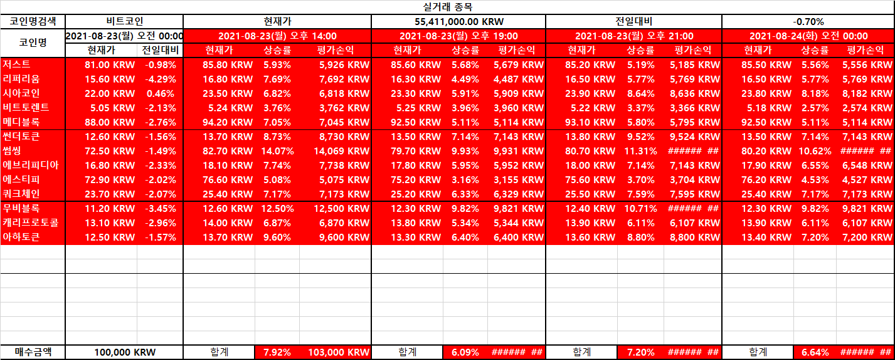</p>
<p align="center">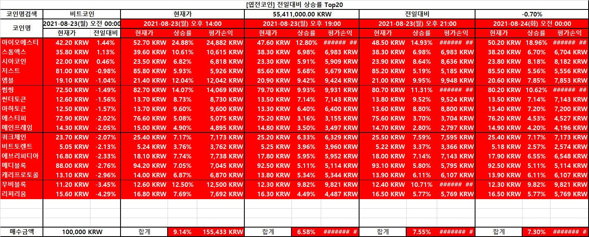</p>
<p align="center">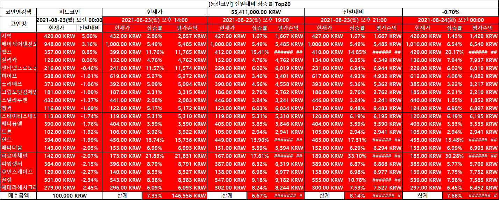</p>
<p align="center">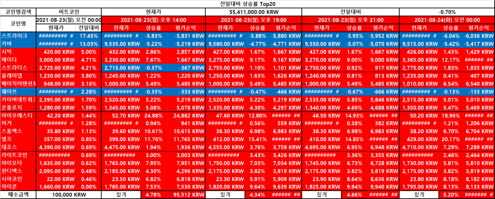</p>
<p align="center"></p>
<p align="center">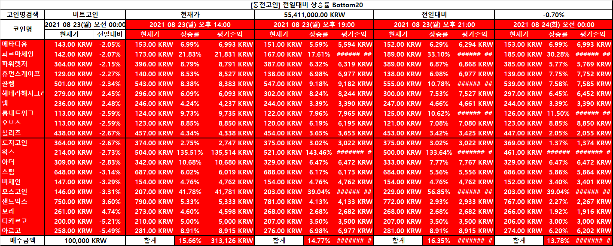</p>
<p align="center">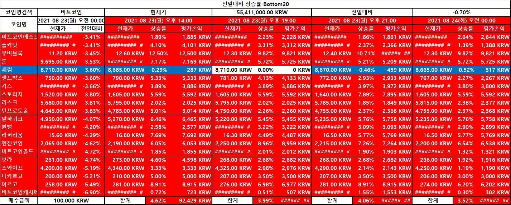</p>

### 5. 2 Monthly Analysis

<p align="center">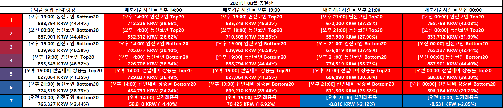</p>
<p align="center">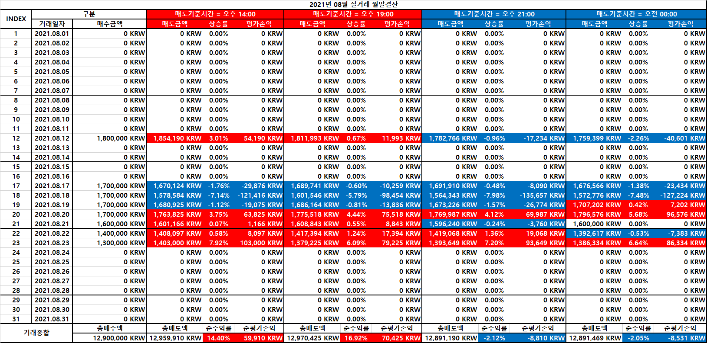</p>
<p align="center">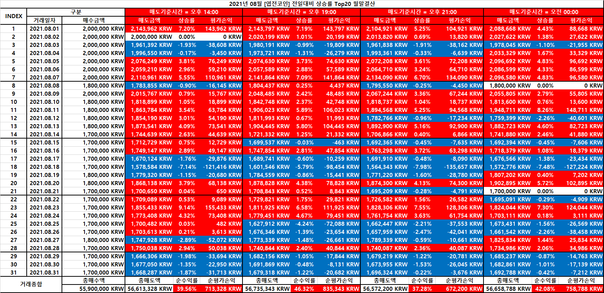</p>
<p align="center">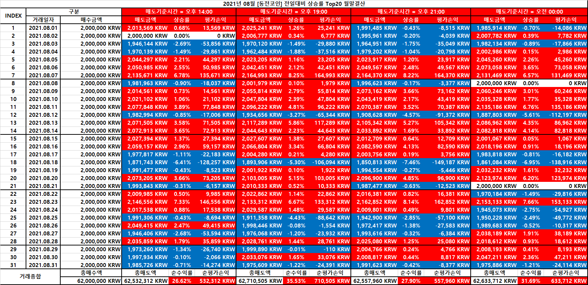</p>
<p align="center">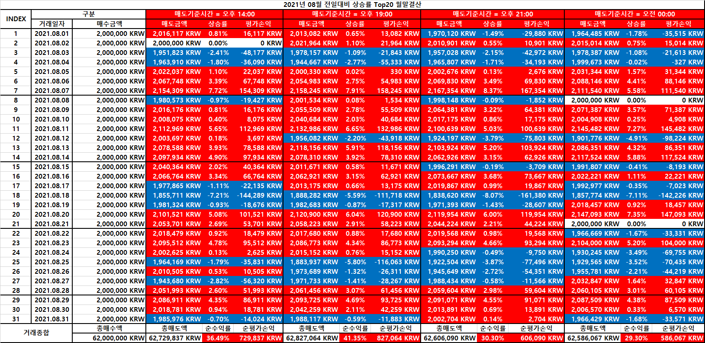</p>
<p align="center">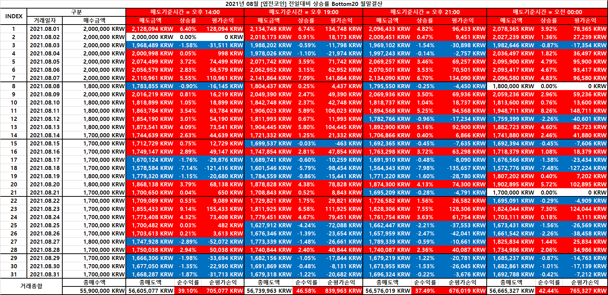</p>
<p align="center">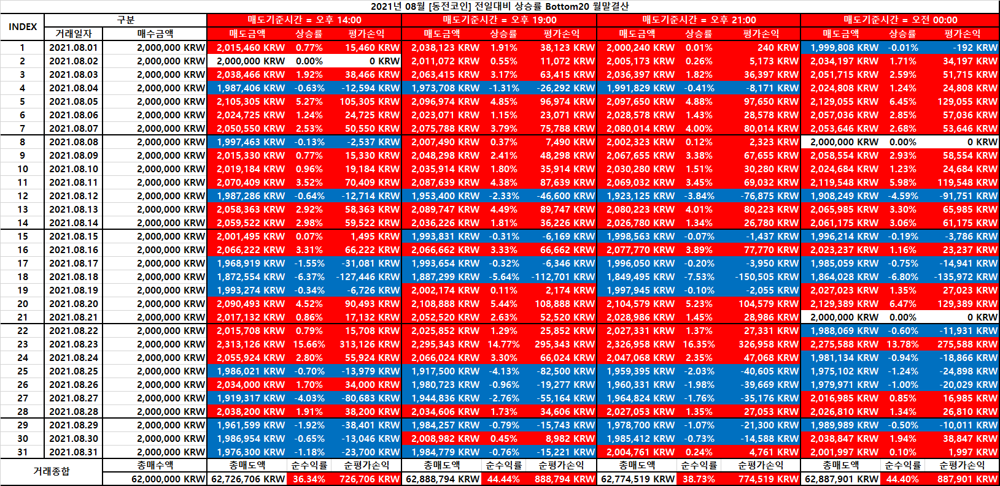</p>
<p align="center">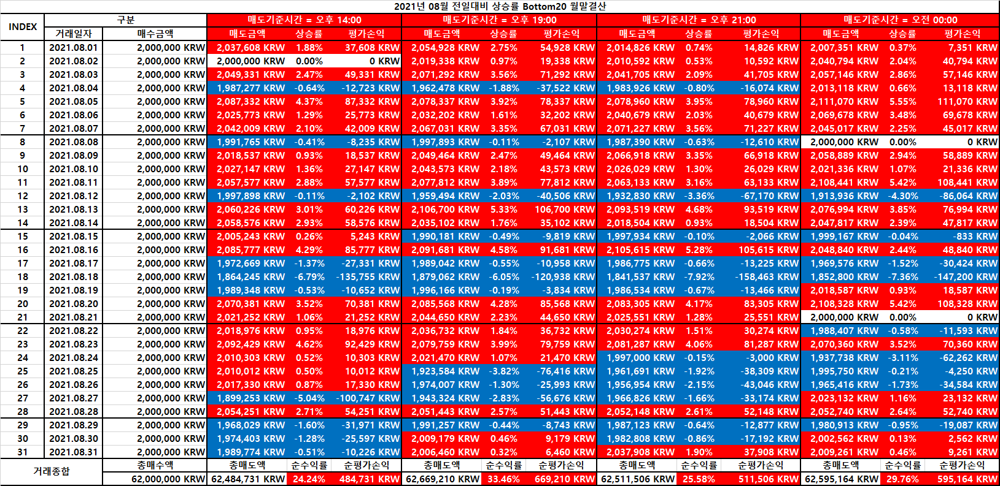</p>
